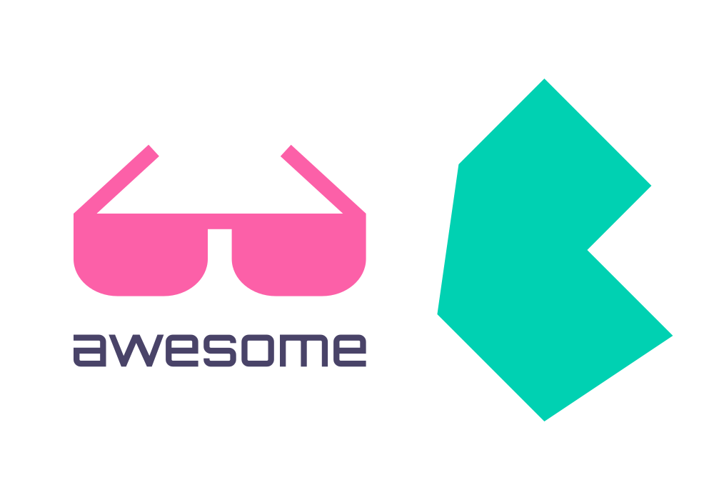

  

# Awesome Bulma 

> A curated list of awesome things related to Bulma CSS Framework

## Table of Contents

- [Resources](#resources)
  - [Useful Links](#useful-links)
  - [Starters](#starters)
  - [Templates](#templates)
  - [IDE Extensions](#ide-extensions)
  - [Learning](#learning)
    - [Books](#books)
    - [Video Tutorials](#video-tutorials)
    - [Courses](#courses)

## Resources

### Useful Links

🔗 - [Bulma.io](https://bulma.io) - Official Bulma website  
🔗 - [Bulma Documentation](https://bulma.io/documentation/) - Everything you need to create a website with Bulma  
🔗 - [Bulma on GitHub](https://github.com/tailwindcss/tailwindcss) - Official Bulma repository on GitHub  
🔗 - [Bulma on Gitter](https://gitter.im/jgthms/bulma) - Official Bulma Community on Gitter  
🔗 - [Bulma NPM Package](https://www.npmjs.com/package/bulma) - Official Bulma NPM Package

### Starters

🏁 - [bulma-start](https://github.com/jgthms/bulma-start) - A tiny npm package to get started  
🏁 - [bulmapress](https://github.com/teamscops/bulmapress) - A WordPress flexbox theme  
🏁 - [base-camp](https://github.com/suomato/base-camp) - Awesome WordPress starter theme with own CLI with Bulma  
🏁 - [bulmascores](https://github.com/Nicuz/Bulmascores) - WordPress starter theme based on Underscores and Bulma  
🏁 - [gatsby-starter-netlify-cms](https://github.com/netlify-templates/gatsby-starter-netlify-cms) - Gatsby + Netlify CMS Starter with Bulma  
🏁 - [gatsby-bulma-quickstart](https://github.com/amandeepmittal/gatsby-bulma-quickstart) - A Bulma CSS + GatsbyJS Starter Kit  
🏁 - [gatsby-starter-bloomer](https://github.com/Cethy/gatsby-starter-bloomer) - A Gatsby starter based on Bulma and Bloomer  
🏁 - [gatsby-starter-bulma-storybook](https://github.com/gvaldambrini/gatsby-starter-bulma-storybook) - A minimal Gatsby starter which includes Bulma and Storybook  
🏁 - [gatsby-starter-i18n-bulma](https://github.com/kalwalt/gatsby-starter-i18n-bulma) - A gatsby multilanguage template with bulma and i18n  
🏁 - [phoenix-starter](https://github.com/awestbro/phoenix-starter) - Elixir | Phoenix | Webpack | Bulma  
🏁 - [gridsome-bulma](https://github.com/calebanthony/gridsome-bulma) - A Gridsome starter with Bulma  
🏁 - [next-starter](https://github.com/techno246/next-starter) - Next.js starter project with Bulma, SASS, ESLint  
🏁 - [starter-angular-loopback-bulma](https://github.com/angular-indonesia/starter-angular-loopback-bulma) - A Starter Template using Angular & Bulma with a Loopback Backend  
🏁 - [react-starter](https://github.com/chvid/react-starter) - A starter for React/Bulma/Webpack  
🏁 - [next-bulma](https://github.com/louiskhenghao/next-bulma) - NextJs with Bulma CSS Framework  
🏁 - [hyperbulma](https://github.com/cutemachine/hyperbulma) - A starter project for using Hyperapp with Bulma CSS  
🏁 - [parcel-starter-kit](https://github.com/emendelski/parcel-starter-kit) - Simple boilerplate: Parcel, Bulma, Babel, Autoprefixer, Posthtml, Eslint and SCSS

### Templates  

🎨 - [awesome-bulma-templates](https://github.com/aldi/awesome-bulma-templates/tree/master/templates) - Free Real World Templates built with Bulma  
🎨 - [bulma-rent-template](https://github.com/aldi/bulma-rent-template) - Free Rent Template built with Bulma  
🎨 - [bulma-cv-template](https://github.com/aldi/bulma-cv-template) - Free CV Template built with Bulma  
🎨 - [bulma-hotel-template](https://github.com/aldi/bulma-hotel-template) - Free Hotel Template built with Bulma  
🎨 - [bulma-coming-soon-template](https://github.com/aldi/bulma-coming-soon-template) - Free Coming Soon Template built with Bulma  
🎨 - [bulma-login-template](https://github.com/aldi/bulma-login-template) - Free Login Page Template built with Bulma  
🎨 - [bulma-event-participation-template](https://github.com/aldi//bulma-event-participation-template) - Free Event Participation Template built with Bulma  
🎨 - [bulma-landing-page-template](https://github.com/hellobetkowski/bulma-product-landing-page-template) - Free App/Landing Page Template built with Bulma  
🎨 - [bulma-admin-dashboard-template](https://github.com/mazipan/bulma-admin-dashboard-template) - Free Admin Dashboard Template built with Bulma  
🎨 - [bulma-resume-template](https://github.com/mazipan/bulma-resume-template) - Free Resume Page Template built with Bulma  
🎨 - [bulma-login-template](https://github.com/adriancast/Bulma-login-template) - Free Login Page Template built with Bulma  
🎨 - [bulma-templates](https://github.com/BulmaTemplates/bulma-templates) - Free Flexbox Templates built with Bulma  
🎨 - [bulma-templates-admin-light](https://bulmatemplates.github.io/bulma-templates) - Free Admin Light Template built with the Bulma  
🎨 - [bulma-templates-band](https://bulmatemplates.github.io/bulma-templates/) - Free Band Template built with Bulma  
🎨 - [bulma-templates-blog](https://bulmatemplates.github.io/bulma-templates/) - Free Blog Template built with Bulma  
🎨 - [bulma-templates-cards](https://bulmatemplates.github.io/bulma-templates/) - Free Cards Template built with Bulma  
🎨 - [bulma-templates-cheatsheet](https://bulmatemplates.github.io/bulma-templates/) - Free Cheatsheet Template built with Bulma  
🎨 - [bulma-templates-cover](https://bulmatemplates.github.io/bulma-templates/) - Free Cover Template built with Bulma  
🎨 - [bulma-templates-forum](https://bulmatemplates.github.io/bulma-templates/) - Free Forum Template built with Bulma  
🎨 - [bulma-templates-hero](https://bulmatemplates.github.io/bulma-templates/) - Free Hero Template built with Bulma  
🎨 - [bulma-templates-inbox](https://bulmatemplates.github.io/bulma-templates/) - Free Inbox Template built with Bulma  
🎨 - [bulma-templates-image-timeline](https://bulmatemplates.github.io/bulma-templates/) - Free Image Timeline Template built with Bulma  
🎨 - [bulma-templates-kanban](https://bulmatemplates.github.io/bulma-templates/) - Free Kanban Template built with Bulma  
🎨 - [bulma-templates-kanban.js](https://bulmatemplates.github.io/bulma-templates/) - Free Kanban.js Template built with Bulma  
🎨 - [bulma-templates-landing](https://bulmatemplates.github.io/bulma-templates/) - Free Landing Template built with Bulma  
🎨 - [bulma-templates-login](https://bulmatemplates.github.io/bulma-templates/) - Free Login Template built with Bulma  
🎨 - [bulma-templates-modal-cards](https://bulmatemplates.github.io/bulma-templates/) - Free Modal Cards Template built with Bulma  
🎨 - [bulma-templates-portfolio](https://bulmatemplates.github.io/bulma-templates/) - Free Portfolio Template built with Bulma  
🎨 - [bulma-templates-showcase](https://bulmatemplates.github.io/bulma-templates/) - Free Showcase Template built with Bulma  
🎨 - [bulma-templates-tabs](https://bulmatemplates.github.io/bulma-templates/) - Free Tabs Τemplate built with Bulma  
🎨 - [bulma-admin](https://github.com/nafplann/bulma-admin) - Free Admin Panel Template based on Bulma  
🎨 - [jekyll-bulma](https://github.com/erayaydin/jekyll-bulma) - Bulma Jekyll Template based on Bulma  
🎨 - [bulma-dashboard](https://github.com/SamZCoder/Bulma-Dashboard/) - Free Dashboard Template built with Bulma  

### IDE Extensions

💻 - [Bulma for VS Code](https://marketplace.visualstudio.com/items?itemName=demijollamaxime.bulma) - A set of Bulma Snippets for Visual Studio Code  
💻 - [Bulma Snippets for VS Code](https://marketplace.visualstudio.com/items?itemName=fiazluthfi.bulma-snippets) - Visual Studio Code snippet extension for Tailwind CSS  
💻 - [Bulma Snippets for Sublime Text 3](https://github.com/OthmaneBlial/Bulma-Snippets-Sublime-Text-Plugin) - A set of Bulma Snippets for Sublime Text  
💻 - [Bulma Autocomplete for Sublime Text 3](https://github.com/leuchte/bulma-autocomplete) - Sublime Text autocomplete plugin for the Bulma CSS Framework  
💻 - [Bulma Autocomplete 2.0 for Atom](https://github.com/lowlevelm/Bulma-autocomplete-2) - An Atom module to improve your Bulma workflow  

### Open-Source Projects

:octocat: - [FileGator](https://github.com/filegator/filegator) - Powerful Multi-User File Manager  
:octocat: - [Bulmaswatch](https://jenil.github.io/bulmaswatch/) - Themes for Bulma  

## Learning

### Books

📚 - [Creating interfaces with Bulma](https://jgthms.com/creating-interfaces-with-bulma-ebook/) - by Jeremy Thomas  
📚 - [Learning Bulma](https://www.apress.com/gp/book/9781484254813/) by Aravind Shenoy  

### Video Tutorials

🎬 - [Bulma CSS Framework Crash Course](https://www.youtube.com/watch?v=IiPQYQT2-wg) - by TraversyMedia  
🎬 - [Bulma CSS Framework - Complete Tutorial](https://www.youtube.com/watch?v=LBzZLzu2GKo) - by FreeCodeCamp  
🎬 - [Bulma CSS Framework - 1. Button Styles](https://www.youtube.com/watch?v=LBzZLzu2GKo) - by Paul Halliday  
🎬 - [Bulma CSS Framework - 2. Notifications](https://www.youtube.com/watch?v=LBzZLzu2GKo) - by Paul Halliday  
🎬 - [Bulma CSS Framework - 3. Progress Bars](https://www.youtube.com/watch?v=LBzZLzu2GKo) - by Paul Halliday  
🎬 - [Bulma CSS Framework - 4. Tags](https://www.youtube.com/watch?v=LBzZLzu2GKo) - by Paul Halliday  
🎬 - [Responsive Bulma CSS Navigation Bar](https://www.youtube.com/watch?v=LBzZLzu2GKo) - by abwebtuts  
🎬 - [Bulma CSS Framework - 1. Buttons & Modifiers](https://www.youtube.com/watch?v=Z6RtMMmiHq0) - by Rocky DeRaze  
🎬 - [Bulma CSS Framework - 2. Helpers & Helper Classes](https://www.youtube.com/watch?v=VCwOsDJOZ3s) - by Rocky DeRaze  
🎬 - [Bulma CSS Framework - 3. Responsive Helpers](https://www.youtube.com/watch?v=z47FvpbmJRg) - by Rocky DeRaze  
🎬 - [Bulma CSS Framework - 4. Grid Columns - Layout](https://www.youtube.com/watch?v=desqDL5d_7I) - by Rocky DeRaze  
🎬 - [Bulma CSS Framework - 5. Grid Columns - Responsiveness](https://www.youtube.com/watch?v=gbiRO5npbpY) - by Rocky DeRaze  
🎬 - [Bulma CSS Framework - Admin Dashboard Template Design](https://www.youtube.com/watch?v=RD2m0FkTS_o) - by FrontEndFunn  
🎬 - [Intro to Bulma - A CSS Framework](https://www.youtube.com/watch?v=I8ezFcJ6AeM) - by Pretty Printed  
🎬 - [How to create tiles in Bulma](https://www.youtube.com/watch?v=H-2tcg_Qvhs) - by Pretty Printed  
🎬 - [Bulma Layouts - Sections, Containers, Columns, Levels](https://www.youtube.com/watch?v=ouI1_tZ1yK4) - by Pretty Printed  
🎬 - [JavaScript Zipcode App Using Fetch & Bulma CSS](https://www.youtube.com/watch?v=K3GfUH7AZKs) - by Traversy Media  

### Courses

🎓 - [Learn Bulma CSS for free](https://scrimba.com/g/gbulma) - Shimba  

## Contribute

Contributions welcome!

## License

To the extent possible under law, [aldi](https://github.com/aldi) has waived all copyright and related or neighboring rights to this work.
