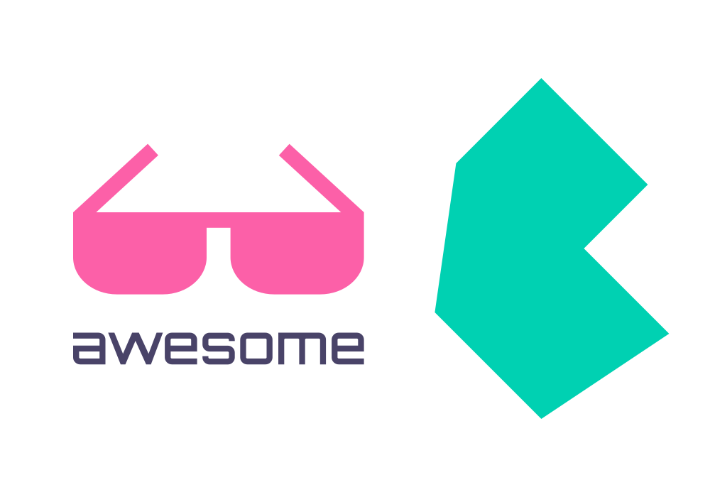

  

# Awesome Bulma 

> A curated list of awesome things related to Bulma CSS Framework

## Table of Contents

- [Resources](#resources)
  - [Useful Links](#useful-links)
  - [Starters](#starters)
  - [Templates](#templates)
  - [Themes](#themes)
  - [IDE Extensions](#ide-extensions)
  - [Open-Source Projects](#open-source-projects)
  - [Learning](#learning)
    - [Books](#books)
    - [Video Tutorials](#video-tutorials)
    - [Courses](#courses)
- [UI Libraries & Components](#ui-libraries--components)
- [Extensions](#extensions)
- [Expo](#expo)

## Resources

### Useful Links

🔗 - [Bulma](https://bulma.io) - Official website  
🔗 - [Documentation](https://bulma.io/documentation/) - Guides and reference  
🔗 - [GitHub](https://github.com/jgthms/bulma) - Source code, issues, and releases  
🔗 - [npm](https://www.npmjs.com/package/bulma) - Package versions and install instructions

### Starters

***Note:** These starters are built for **Bulma v0.9** and are not yet compatible with v1.*  
🏁 - [bulma-start](https://github.com/jgthms/bulma-start) - A tiny npm package to get started  
🏁 - [gatsby-starter-netlify-cms](https://github.com/netlify-templates/gatsby-starter-netlify-cms) - Gatsby + Decap CMS (formerly Netlify CMS) with Bulma  
🏁 - [next-bulma](https://github.com/louiskhenghao/next-bulma) - NextJs with Bulma CSS Framework  
🏁 - [react-starter](https://github.com/chvid/react-starter) - A starter for React/Bulma/Webpack  

### IDE Extensions

💻 - [Bulma for VS Code](https://marketplace.visualstudio.com/items?itemName=demijollamaxime.bulma) - A set of Bulma Snippets for Visual Studio Code  
💻 - [Bulma Snippets for VS Code](https://marketplace.visualstudio.com/items?itemName=fiazluthfi.bulma-snippets) - Visual Studio Code snippet extension for Bulma CSS  
💻 - [Bulma Snippets for Sublime Text 3](https://github.com/OthmaneBlial/Bulma-Snippets-Sublime-Text-Plugin) - A set of Bulma Snippets for Sublime Text  
💻 - [Bulma Autocomplete for Sublime Text 3](https://github.com/leuchte/bulma-autocomplete) - Sublime Text autocomplete plugin for the Bulma CSS Framework  
💻 - [Bulma Autocomplete 2.0 for Atom](https://github.com/lowlevelm/Bulma-autocomplete-2) - An Atom module to improve your Bulma workflow

### Open-Source Projects

:octocat: - [FileGator](https://github.com/filegator/filegator) - Powerful Multi-User File Manager  
:octocat: - [VaahCMS](https://github.com/webreinvent/vaahcms) - Laravel based open-source headless CMS with Bulma  
:octocat: - [Laravel Enso](https://github.com/laravel-enso/enso) - Laravel Vue SPA, Bulma themed admin panel  

### Templates

🖼️ - [awesome-bulma-templates](https://github.com/aldi/awesome-bulma-templates/) - Free Real World Templates built with Bulma  
🖼️ - [bulma-rent-template](https://github.com/aldi/bulma-rent-template) - Free Rent Template built with Bulma  
🖼️ - [bulma-cv-template](https://github.com/aldi/bulma-cv-template) - Free CV Template built with Bulma  
🖼️ - [bulma-hotel-template](https://github.com/aldi/bulma-hotel-template) - Free Hotel Template built with Bulma  🖼️ - [bulma-coming-soon-template](https://github.com/aldi/bulma-coming-soon-template) - Free Coming Soon Template built with Bulma  
🖼️ - [bulma-event-participation-template](https://github.com/aldi//bulma-event-participation-template) - Free Event Participation Template built with Bulma  
🖼️ - [bulma-landing-page-template](https://github.com/hellobetkowski/bulma-product-landing-page-template) - Free App/Landing Page Template built with Bulma  
🖼️ - [bulma-login-template](https://github.com/aldi/bulma-login-template) - Free Login Page Template built with Bulma  
🖼️ - [bulma-admin-dashboard-template](https://github.com/mazipan/bulma-admin-dashboard-template) - Free Admin Dashboard Template built with Bulma  
🖼️ - [bulma-resume-template](https://github.com/mazipan/bulma-resume-template) - Free Resume Page Template built with Bulma  
🖼️ - [bulma-templates](https://github.com/BulmaTemplates/bulma-templates) - Free Flexbox Templates built with Bulma  
🖼️ - [bulma-templates-admin-light](https://bulmatemplates.github.io/bulma-templates) - Free Admin Light Template built with the Bulma  
🖼️ - [bulma-templates-band](https://bulmatemplates.github.io/bulma-templates/) - Free Band Template built with Bulma  
🖼️ - [bulma-templates-blog](https://bulmatemplates.github.io/bulma-templates/) - Free Blog Template built with Bulma  🖼️ - [bulma-templates-cards](https://bulmatemplates.github.io/bulma-templates/) - Free Cards Template built with Bulma  
🖼️ - [bulma-templates-cheatsheet](https://bulmatemplates.github.io/bulma-templates/) - Free Cheatsheet Template built with Bulma  
🖼️ - [bulma-templates-cover](https://bulmatemplates.github.io/bulma-templates/) - Free Cover Template built with Bulma  
🖼️ - [bulma-templates-forum](https://bulmatemplates.github.io/bulma-templates/) - Free Forum Template built with Bulma  
🖼️ - [bulma-templates-hero](https://bulmatemplates.github.io/bulma-templates/) - Free Hero Template built with Bulma  
🖼️ - [bulma-templates-inbox](https://bulmatemplates.github.io/bulma-templates/) - Free Inbox Template built with Bulma  
🖼️ - [bulma-templates-image-timeline](https://bulmatemplates.github.io/bulma-templates/) - Free Image Timeline Template built with Bulma  
🖼️ - [bulma-templates-kanban](https://bulmatemplates.github.io/bulma-templates/) - Free Kanban Template built with Bulma  
🖼️ - [bulma-templates-kanban.js](https://bulmatemplates.github.io/bulma-templates/) - Free Kanban.js Template built with Bulma  
🖼️ - [bulma-templates-landing](https://bulmatemplates.github.io/bulma-templates/) - Free Landing Template built with Bulma  
🖼️ - [bulma-templates-login](https://bulmatemplates.github.io/bulma-templates/) - Free Login Template built with Bulma  
🖼️ - [bulma-templates-modal-cards](https://bulmatemplates.github.io/bulma-templates/) - Free Modal Cards Template built with Bulma  
🖼️ - [bulma-templates-portfolio](https://bulmatemplates.github.io/bulma-templates/) - Free Portfolio Template built with Bulma  
🖼️ - [bulma-templates-showcase](https://bulmatemplates.github.io/bulma-templates/) - Free Showcase Template built with Bulma  
🖼️ - [bulma-templates-tabs](https://bulmatemplates.github.io/bulma-templates/) - Free Tabs Τemplate built with Bulma  
🖼️ - [bulma-admin](https://github.com/nafplann/bulma-admin) - Free Admin Panel Template based on Bulma  
🖼️ - [jekyll-bulma](https://github.com/erayaydin/jekyll-bulma) - Bulma Jekyll Template based on Bulma  
🖼️ - [bulma-dashboard](https://github.com/SamZCoder/Bulma-Dashboard/) - Free Dashboard Template built with Bulma

### Themes

🎨 - [bulmaswatch](https://jenil.github.io/bulmaswatch/) - Themes for Bulma  
🎨 - [Bulma On Demand](https://bulma-on-demand.vercel.app) - Customize Bulma without installing anything  

## Learning

### Books

📚 - [Creating interfaces with Bulma](https://jgthms.com/creating-interfaces-with-bulma-ebook/) - by Jeremy Thomas  
📚 - [Learning Bulma](https://www.apress.com/gp/book/9781484254813/) by Aravind Shenoy

### Video Tutorials

#### 2022

- 🎬 - [Build UI using Bulma | Gravity - Part 3 | Chrome extension tutorial](http://www.youtube.com/watch?v=CrxMU1u50Rs) - by LetCode with Koushik
- 🎬 - [10 Sass and Bulma](http://www.youtube.com/watch?v=HOyiGbAd33c) - by Dev tips by MoHo
- 🎬 - [How to Install Bulma CSS Using npm on Windows: A 60-Second Step-by-Step Guide](http://www.youtube.com/watch?v=y5_uMpC0exM) - by HackerandCoder

#### 2021

- 🎬 - [CSS framework in 20 minutes | Bootstrap | Materialize | Bulma | Tailwind | Bootswatch](https://www.youtube.com/watch?v=hfLJ56iALWw) - by Coding Jitsu

#### 2020

- 🎬 - [Bulma CSS Tutorial Playlist](http://www.youtube.com/playlist?list=PL4cUxeGkcC9iXItWKbaQxcyDT1u6E7a8a) - by Net Ninja

#### 2019

- 🎬 - [Bulma css framework - Admin Dashboard Template Design](https://www.youtube.com/watch?v=RD2m0FkTS_o) - by FrontEndFunn

#### 2018

- 🎬 - [Bulma CSS Framework - Complete Tutorial](https://www.youtube.com/watch?v=LBzZLzu2GKo) - by freeCodeCamp.org  
- 🎬 - [Responsive Bulma CSS Navigation Bar](https://www.youtube.com/watch?v=I6nuWeylMYM) - by abwebtuts
- 🎬 - [Bulma Layouts - Sections, Containers, Columns, Levels](https://www.youtube.com/watch?v=ouI1_tZ1yK4) - by Pretty Printed
- 🎬 - [Intro to Bulma - A CSS Framework](https://www.youtube.com/watch?v=I8ezFcJ6AeM) - by Pretty Printed  
- 🎬 - [How to create tiles in Bulma](https://www.youtube.com/watch?v=H-2tcg_Qvhs) - by Pretty Printed

#### 2017

- 🎬 - [Bulma CSS Framework Crash Course](https://www.youtube.com/watch?v=IiPQYQT2-wg) - by TraversyMedia  
- 🎬 - [JavaScript Zipcode App Using Fetch & Bulma CSS](https://www.youtube.com/watch?v=K3GfUH7AZKs) - by Traversy Media  
- 🎬 - [Bulma CSS Framework - 1. Buttons & Modifiers](https://www.youtube.com/watch?v=Z6RtMMmiHq0) - by Rocky DeRaze  
- 🎬 - [Bulma CSS Framework - 2. Helpers & Helper Classes](https://www.youtube.com/watch?v=VCwOsDJOZ3s) - by Rocky DeRaze  
- 🎬 - [Bulma CSS Framework - 3. Responsive Helpers](https://www.youtube.com/watch?v=z47FvpbmJRg) - by Rocky DeRaze  
- 🎬 - [Bulma CSS Framework - 4. Grid Columns - Layout](https://www.youtube.com/watch?v=desqDL5d_7I) - by Rocky DeRaze  
- 🎬 - [Bulma CSS Framework - 5. Grid Columns - Responsiveness](https://www.youtube.com/watch?v=gbiRO5npbpY) - by Rocky DeRaze  
- 🎬 - [Bulma CSS Framework - Progress Bars](https://www.youtube.com/watch?v=JBY-qOXcf3s) - by Paul Halliday  
- 🎬 - [Bulma CSS Framework - Notifications](https://www.youtube.com/watch?v=PLEZCWuJ6s0) - by Paul Halliday  
- 🎬 - [Bulma CSS Framework - Button Styles](https://www.youtube.com/watch?v=IGrtt9iMn2c) - by Paul Halliday  
- 🎬 - [Bulma CSS Framework - Tags](https://www.youtube.com/watch?v=j7NdJ5w3g4Q) - by Paul Halliday  

### Courses

🎓 - [Learn Bulma CSS for free](https://scrimba.com/g/gbulma) - Shimba  
🎓 - [Building Websites with Bulma](https://www.pluralsight.com/courses/building-websites-bulma) - Pluralsight  
🎓 - [Learn Bulma CSS for free](https://coursesity.com/course-detail/learn-bulma-css-for-free-) - Coursesity

## UI Libraries & Components

- [buefy](https://buefy.org/) - Lightweight UI components for Vue.js based on Bulma
- [oruga](https://github.com/oruga-ui/oruga) - UI components library without CSS framework dependency
- [blazorise](https://github.com/Megabit/Blazorise) - Components for Blazor with support for Bulma
- [react-bulma-components](https://github.com/couds/react-bulma-components/) - React components for Bulma
- [bulma-rails](https://github.com/joshuajansen/bulma-rails/) - Integrates Bulma with the rails asset pipeline
- [bloomer](https://github.com/AlgusDark/bloomer/) - A set of React components for Bulma
- [svelma](https://github.com/c0bra/svelma/) - Bulma components for Svelte
- [react-bulma](https://github.com/kulakowka/react-bulma/) - React.js components for Bulma
- [bulmil](https://github.com/gomah/bulmil) - Web Components library based on Bulma and Stencil
- [vue-bulma-components](https://github.com/vouill/vue-bulma-components) - Bulma components for Vue.js 2
- [svelte-bulma-components](https://github.com/elcobvg/svelte-bulma-components/) - Collection of Bulma UI components for Svelte
- [ember-bulma](https://github.com/open-tux/ember-bulma) - Ember.js components for Bulma
- [bulma-styled-components](https://github.com/mpaupulaire4/bulma-styled-components) - Bulma with styled-components
- [ng-wizi-bulma](https://github.com/WiziShop/ng-wizi-bulma/) - Bulma components for Angular
- [bulma.io-axure](https://github.com/Code-Mine-Development/Bulma.io-axure) - AxureRP Library with Bulma components
- [ralma](https://github.com/aldi/ralma/) - Ractive.js Components for Bulma

## Extensions

- [bulma-social](https://aldi.github.io/bulma-social) - 🤳 Social Sign-In Buttons based on Bulma and Font Awesome
- [bulma-calendar](https://wikiki.github.io/components/calendar) - Display a calendar with different colors and sizes
- [bulma-timeline](https://wikiki.github.io/components/timeline) - Display a vertical timeline, in different colors, sizes, and states
- [bulma-carousel](https://github.com/Wikiki/bulma-carousel) - Bulma's extension to display a Carousel
- [bulma-megamenu](https://github.com/hunzaboy/bulma-megamenu/) - Bulma extension to make Mega Menus
- [bulma-steps](https://wikiki.github.io/components/steps) - Display steps for a process with different colors, sizes, and states
- [bulma-switch](https://wikiki.github.io/form/switch) - Display the classic checkbox as a switch button with different colors, sizes, and states
- [bulma-pageloader](https://wikiki.github.io/elements/pageloader) - Display a page-loader to inform users that content is loading, in different colors
- [bulma-checkradio](https://wikiki.github.io/form/checkradio) - Make classic checkbox and radio sexier with different colors, sizes, and states
- [bulma-pricingtable](https://wikiki.github.io/components/pricingtable/) - Display an input as an Icon Picker to ease the user icon selection
- [bulma-accordion](https://wikiki.github.io/components/accordion) - A simple accordion extension for Bulma
- [bulma-slider](https://wikiki.github.io/form/slider) - Display a classic slider with different colors, sizes, and states
- [bulma-ribbon](https://github.com/Wikiki/bulma-ribbon) - Bulma's extension to show a ribbon on boxes
- [bulma-quickview](https://wikiki.github.io/components/quickview/) - Display a quick view of data without leaving the current page
- [bulma-carousel](https://creativebulma.net/product/carousel/demo) - A simple carousel/slider extension for Bulma
- [bulma-iconpicker](https://wikiki.github.io/form/iconpicker/) - Display an input as an Icon Picker to ease the user icon selection
- [bulma-o-steps](https://octoshrimpy.github.io/bulma-o-steps/) - An in-depth steps extension for multi-step forms or wizards
- [bulma-coolcheckboxes](https://github.com/hunzaboy/Cool-Checkboxes-for-Bulma.io) - Cool CSS based checkbox for Bulma
- [bulma-dashboard](https://github.com/lucperkins/bulma-dashboard) - Write easily dashboard-style interfaces with fixed horizontal panels
- [bulma-steps (alternative)](https://aramvisser.github.io/bulma-steps/) - Keep track of where you are in multi steps forms and wizards
- [bulma-divider](https://wikiki.github.io/layout/divider) - Display a vertical or horizontal divider to segment your design
- [bulma-badge](https://wikiki.github.io/elements/badge) - Display a badge element in front of Bulma's element in different colors
- [bulma-tooltip](https://wikiki.github.io/elements/tooltip) - Display a tooltip attached to any kind of element with different positioning
- [bulma-toast](https://github.com/rfoel/bulma-toast/) - Bulma's pure JavaScript extension to display toasts
- [bulma-tagsinput](https://wikiki.github.io/form/tagsinput/) - Modernize an add interaction on input of tags type
- [bulma-block-list](https://github.com/chrisrhymes/bulma-block-list) - A simple scss package extending Bulma with block style list elements
- [bulma-spacing](https://github.com/kaangokdemir/bulma-spacing) - Missing spacing classes for Bulma ecosystem
- [bulma-o-steps](https://octoshrimpy.github.io/bulma-o-steps) - Steps Component For Bulma.io
- [bulma-tagsfield](https://github.com/crabvk/bulma-tagsfield) - Multi-line tags input control
- [bulma-list](https://github.com/bluefantail/bulma-list) - A simple list component extension for Bulma

## Expo

✨ - [Divjoy](https://divjoy.com/)  
✨ - [ftw](https://next.ftwcoin.io/)  
✨ - [Spike](https://spike.sh/)  
✨ - [Runlet](https://runlet.app/)  
✨ - [Bulma Play](https://bulma-css-bulmaplay.appseed.us//)  
✨ - [Filegator](https://demo.filegator.io/)  
✨ - [Sinuous](https://sinuous.netlify.app/)  
✨ - [Agilox](https://www.agilox.net/en)  
✨ - [Pingstack](https://pingstack.io/)  
✨ - [SaaSHub](https://www.saashub.com/)  
✨ - [Snipper App](https://snipper.app/)  
✨ - [GreenPeace Uncut](https://uncut.ro/index.en.html)  
✨ - [Reception Halls](https://www.receptionhalls.com/)  
✨ - [faulthero](https://www.faulthero.com/)  
✨ - [mattfarley](https://mattfarley.ca/)  
✨ - [jgthms](https://jgthms.com/)  
✨ - [Oneday](https://www.oneday.design/)  
✨ - [Booknshelf](https://booknshelf.com/)  

## Contribute

Contributions welcome! Read the [contribution guidelines](CONTRIBUTING.md) first.

## License

To the extent possible under law, [aldi](https://github.com/aldi) has waived all copyright and related or neighboring rights to this work.